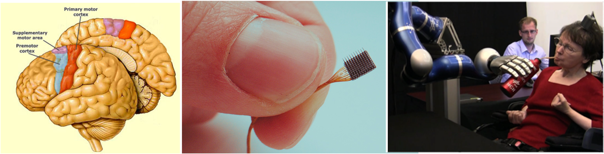
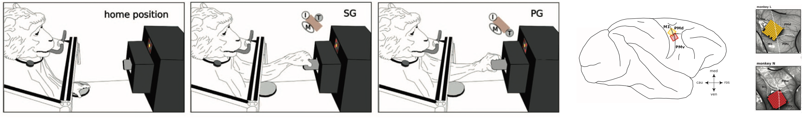
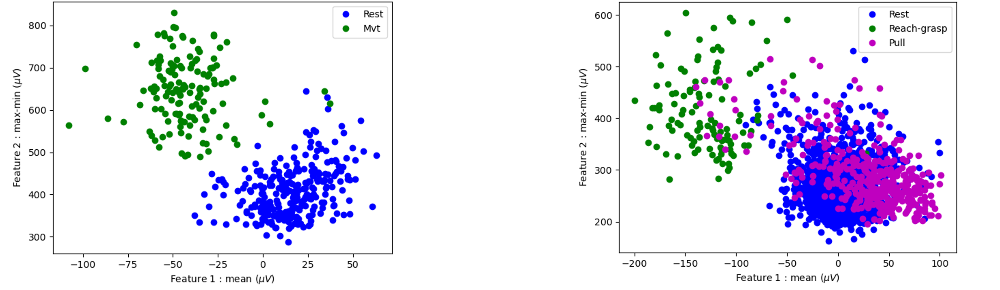

## About me

<a href="https://github.com/pbellec">
   
   <br /><sub><b>JulieLanthier</b></sub>
</a>

Hi, I'm Julie, a master's student in biomedical engineering at Polytechnique
Montréal. I have a background in neurosciences and physics engineering, and 
I have strong interests in neuroprosthetics. The following presents my Brainhack project.

***
***

# A Machine Learning Algorithm to Decode Movements from Intracortical Recordings of the Primary Motor Cortex in Two Macaques


**Keywords:** Machine learning | Linear discriminant analysis | Intracortical recording | Utah array | Motor decoding

## Background and motivation
***
Motor impairments can occur in several situations, even with a typical cerebral activity. For example, in a patient with a spinal cord injury the motor command is still intact, but it cannot reach the limbs. It is also the case of some neurodegenerative diseases, such as amyotrophic lateral sclerosis (ALS), where a deterioration of the motoneurons is observed. This applies also to amputations, where the motor command is normal, but the limb is not there to achieve the movement. To overcome this problem, some researchers are trying to extract this motor command that is complete, decode it, and have it executed by various methods, such as functional electrical stimulation (FES) of the appropriate muscles or nerves, or by using a motorized prothesis or a robotic arm (Hocheberg et al., 2012; Rubin et al., 2022; Herring et al., 2023). A promising way of extracting the motor command is to record the neural activity directly in the motor cortex. This can be done with a [Utah electrode array](https://blackrockneurotech.com/products/utah-array/), which has 10x10 electrodes. Finally, a substantial aspect of these methods is to properly translate the motor command recorded. This is why the aim of this project is to use machine learning to decode motor commands from recordings of the primary motor cortex of two macaques. 




## Project general description
***
### Data 

The experiment and the dataset are thoroughly documented in the [paper](https://www.ncbi.nlm.nih.gov/pmc/articles/PMC5892370/) of Brochier et al. (2018). 
The dataset provides recordings from two macaques, each implanted with a Utah electrode array in the primary motor cortex (M1). Signal was recorded during a simple reach-to-grasp task. The data from 135 and 141 correct trials are available for monkey L and monkey N, respectively. Raw data, preprocessed data, and metadata are available. 


### Methods

A first set of analyzes aims to differentiate rest from movement. *“Rest”* and *“Mvt”* labels were applied to the raw data, using the temporal events indicated in the metadata. With a sliding window, features of interest were extracted from the data and associated with the corresponding label. A simple 2D plot was then used to visualized the separability of the two conditions with these specific features, as presented by the example below.



Considering the good separation obtained between the conditions, a linear discriminant analysis (LDA) was chosen. For the first set of analyzes, it was trained on one electrode of the monkey L, and then was tested on 5 other electrodes of the same monkey and 5 electrodes of monkey N. 

For the second set of analyzes, the goal was to classify different types of movements. Using the same methods as above, the data were labelled between rest, reach and grasp movements, and object pulling. The training was made on 1 electrode of monkey L and was tested on one other electrode of the same monkey. 


### Results and limitations

The rest/movement analyzes obtained a mean accuracy over the 10 electrodes tested of 80.2%. The rest/reach-grasp/pull analyzes got an accuracy of 74.2% on the tested electrode. However, these results are on very few electrodes and use far from all the data available, especially in the second set of analyzes. Therefore, the results may be not representative. It would be interesting to reproduce the project using all the available electrodes. Also, the use of the raw data directly has the advantage of reducing the processing steps, which could be beneficial in a real time application. However, in some cases, the entire data is not relevant for the analyzes, and data reduction could be used, and decrease a lot the analyzes time.

### Files
-	data_overview_1_nix.py: This python file reproduces the figures 5 and 7 of the [dataset’s paper](https://www.ncbi.nlm.nih.gov/pmc/articles/PMC5892370/).
-	data_overview_2_nix.py : This python file reproduces the figures 6 and 8 of the [dataset’s paper](https://www.ncbi.nlm.nih.gov/pmc/articles/PMC5892370/).
-	classifier.ipynb : This notebook contains a step by step program of the project  including data preparation, data labelling, feature extraction and visualization, classifier implementation and training, as well as testing and results.


## Project availability and open-source effort
***
### Data availability

The data are available on [g-Node](https://www.g-node.org/), at this [link](https://doi.gin.g-node.org/10.12751/g-node.f83565/). G-Node is a [INCF](https://incf.org/) approved neuroinformatics Node that facilitates data access, data storage, and data analysis of neurophysiological data. It also provides free tools for manipulation of this type of data. 

### Open-science tools

#### Neo
Example codes provided with the dataset, as well as codes produced during this project, use the python package [Neo](https://neuralensemble.org/neo/), which makes a significant effort to increase interoperability in neurophysiological data analysis. It is an attempt to offer a shared common model in neurosciences (Garcia et al., 2014). 

#### Python and jupyter notebook
Example codes provided with the dataset are available in python. And, to increase accessibility, all the codes of this projects are also written in python, either in python scripts or in a jupyter notebook. The latter allow the user to access every step of the project and to visualize the analyses and results, even without downloading the data. 

#### Github
The present Github repository aims to gather all documentation, codes, and references necessary to fully reproduce the project, and even push it further! 


## HOW TO REPRODUCE THIS PROJECT?
***

**Easy!** Follow these simple instructions:

1. **Download the data** following the steps described [here](https://gin.g-node.org/INT/multielectrode_grasp). You will need only the data from the *datasets_nix* folder (you will not need the Blackrock or the Matlab files for this project).

2. **Install the libraries** needed with this line:\
    ```pip install -r requirements.txt```   

3. **Run the notebook *classifier.ipynb*** cell by cell to reproduce every step!


## References
***
Brochier, T., Zehl, L., Hao, Y., Duret, M., Sprenger, J., Denker, M., Grün, S., & Riehle, A. (2018). Massively parallel recordings in macaque motor cortex during an instructed delayed reach-to-grasp task. Scientific data, 5, 180055. https://doi.org/10.1038/sdata.2018.55

Garcia, S., Guarino, D., Jaillet, F., Jennings, T., Pröpper, R., Rautenberg, P. L., Rodgers, C. C., Sobolev, A., Wachtler, T., Yger, P., & Davison, A. P. (2014). Neo: an object model for handling electrophysiology data in multiple formats. Frontiers in neuroinformatics, 8, 10. https://doi.org/10.3389/fninf.2014.00010

Herring, E. Z., Graczyk, E. L., Memberg, W. D., Adams, R. D., Baca-Vaca, G. F., Hutchison, B. C., Krall, J. T., Alexander, B. J., Conlan, E. C., Alfaro, K. E., Bhat, P. R., Ketting-Olivier, A. B., Haddix, C. A., Taylor, D. M., Tyler, D. J., Kirsch, R. F., Ajiboye, A. B., & Miller, J. P. (2023). Reconnecting the Hand and Arm to the Brain: Efficacy of Neural Interfaces for Sensorimotor Restoration after Tetraplegia. medRxiv : the preprint server for health sciences, 2023.04.24.23288977. https://doi.org/10.1101/2023.04.24.23288977

Hochberg, L. R., Bacher, D., Jarosiewicz, B., Masse, N. Y., Simeral, J. D., Vogel, J., Haddadin, S., Liu, J., Cash, S. S., van der Smagt, P., & Donoghue, J. P. (2012). Reach and grasp by people with tetraplegia using a neurally controlled robotic arm. Nature, 485(7398), 372–375. https://doi.org/10.1038/nature11076

Rubin, D. B., Ajiboye, A. B., Barefoot, L., Bowker, M., Cash, S. S., Chen, D., Donoghue, J. P., Eskandar, E. N., Friehs, G., Grant, C., Henderson, J. M., Kirsch, R. F., Marujo, R., Masood, M., Mernoff, S. T., Miller, J. P., Mukand, J. A., Penn, R. D., Shefner, J., Shenoy, K. V., Hochberg, L. R. (2023). Interim Safety Profile From the Feasibility Study of the BrainGate Neural Interface System. Neurology, 100(11), e1177–e1192. https://doi.org/10.1212/WNL.0000000000201707


```python

```
